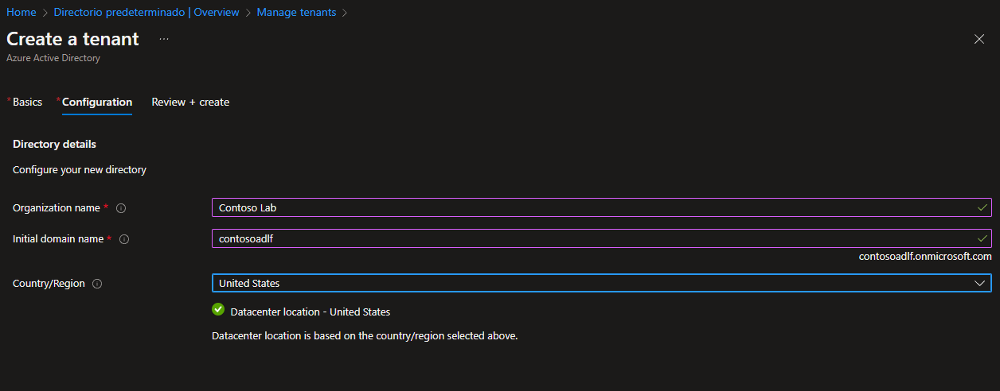

# Lab 01 - Manage Azure Active Directory Identities

*16 de Enero de 2023*

## <u>Objetivos</u>

- **Task 1**: Crear y configurar usuarios de Azure AD.
- **Task 2**: Crear grupos de Azure AD con pertenencia dinámica y asignada.
- **Task 3**: Crear un Azure Active Directory (AD) tenant.
- **Task 4**: Administrar usuarios invitados de Azure AD.

## <u>Diagrama de arquitectura</u>

## <u>Instrucciones</u>

### TASK 1: Crear y configurar usuarios de Azure AD.

1. Iniciamos sesión en el [portal de Azure](https://portal.azure.com/) .

2. En Azure Portal, buscamos y seleccionamos **Azure Active Directory** .

3. En la página de Azure Active Directory, en la parte izquierda clicamos en **Users** y seleccionamos nuestra cuenta principal para ver nuestra configuración.

   

5. Hacemos clic en **Edit properties** y cambiamos nuestra **Usage location** a **United States** y le damos a **Save** para guardar el cambio.

   

6. Volvemos a la página de **Users - All Users** y luego hacemos clic en **+ New user**.

7. Creamos un **nuevo usuario** con la siguiente configuración (dejamos lo demás con sus valores predeterminados):

   | Setting                    | Value                         |
   | :------------------------- | :---------------------------- |
   | User name                  | **az104-01a-aduser1**         |
   | Name                       | **az104-01a-aduser1**         |
   | Let me create the password | Enabled                       |
   | Initial password           | **Provide a secure password** |
   | Usage location             | **United States**             |
   | Job title                  | **Cloud Administrator**       |
   | Department                 | **IT**                        |

7. En la lista de usuarios, hacemos clic en la cuenta de usuario recién creada para mostrar su información.

8. Tendremos que copiar el **User Principal Name** ya que lo necesitaremos mas tarde.

   

9. Hacemos clic en **Assigned roles**, y clicamos en el botón **+ Add assignment** .

10. Y asignamos el rol de **User administrator** a nuestro usuario **az104-01a-aduser1**.

11. Abrimos una ventana del explorador de **Incógnito** e iniciamos sesión en [Azure Portal](https://portal.azure.com/) con la cuenta de usuario recién creada.

12. Una vez que hayamos iniciado sesión con nuestro nuevo usuario creado anteriormente (**az104-01a-aduser1**), nos vamos a **Azure AD** pinchamos en **Users** y le damos clic a **+ New user**.

13. Creamos un nuevo usuario con la siguiente configuración (dejamos lo demás con sus valores predeterminados):

| Setting                    | Value                         |
| :------------------------- | :---------------------------- |
| User name                  | **az104-01a-aaduser2**        |
| Name                       | **az104-01a-aaduser2**        |
| Let me create the password | enabled                       |
| Initial password           | **Provide a secure password** |
| Usage location             | **United States**             |
| Job title                  | **System Administrator**      |
| Department                 | **IT**                        |

### TASK 2: Crear grupos de Azure AD con pertenencia dinámica y asignada.

1. De vuelta en el Portal de Azure donde iniciamos sesión con nuestra **cuenta de usuario principal** , navegamos de nuevo a **Azure Active Directory** yhacemos clic en **Licenses**.

2. Hacemos clic en **All products**.

3. Pinchamos en **+ Try/Buy**  y **activamos** la prueba gratuita de **Azure AD Premium P2**.

   

4. Actualizamos la ventana del navegador para verificar que la activación se realizó correctamente.

1. En la hoja **Licenses - All products**, pinchamos en **Azure Active Directory Premium P2**, le damos a   **+ Assign** y asignamos nuestra cuenta principal y las dos que acabamos de crear.

   

2. En Azure Portal, volvemos a la página de Azure AD y hacemos clic en **Groups** .

3. Usamos el botón **+ New group** para crear un nuevo grupo con la siguiente configuración:

| Setting           | Value                               |
| :---------------- | :---------------------------------- |
| Group type        | **Security**                        |
| Group name        | **IT Cloud Administrators**         |
| Group description | **Contoso IT cloud administrators** |
| Membership type   | **Dynamic User**                    |

8. En la pestaña **Dynamic membership rules** , creamos una nueva regla haciendo clic en **+Add expression** con la siguiente configuración:

| Setting  | Value                   |
| :------- | :---------------------- |
| Property | **jobTitle**            |
| Operator | **Equals**              |
| Value    | **Cloud Administrator** |

9. Guardamos la regla haciendo clic en **Save** .

10. De vuelta en la hoja **Groups - All groups** hacemos clic en el botón **+ New group** y creamos un nuevo grupo con la siguiente configuración:

| Setting           | Value                                |
| :---------------- | :----------------------------------- |
| Group type        | **Security**                         |
| Group name        | **IT System Administrators**         |
| Group description | **Contoso IT system administrators** |
| Membership type   | **Dynamic User**                     |

11. En la pestaña **Dynamic membership rules** , creamos una nueva regla haciendo clic en **+Add expression** con la siguiente configuración:

| Setting  | Value                    |
| :------- | :----------------------- |
| Property | **jobTitle**             |
| Operator | **Equals**               |
| Value    | **System Administrator** |

12. Guardamos la regla haciendo clic en **Save**.

13. Volvemos a la hoja **Groups - All groups** hacemos clic en el botón **+ New group** y creamos un nuevo grupo con la siguiente configuración:

| Setting           | Value                             |
| :---------------- | :-------------------------------- |
| Group type        | **Security**                      |
| Group name        | **IT Lab Administrators**         |
| Group description | **Contoso IT Lab administrators** |
| Membership type   | **Assigned**                      |

14. Una vez que finalizamos estos procesos tendriamos que tener estos grupos creados:

Tendremos que esperar unos minutos o incluso 24h para ver que se han asignado los usuarios correctamente.

Pasadas 24h podemos observar como los usuarios se han asignado automáticamente a sus grupos.

`az104-01a-aduser1 aparecer en IT Cloud Administrator`

`az104-01a-aaduser2 ha de aparecer en IT System Administrator`

### TASK 3: Crear un Azure Active Directory (AD) tenant.

1. En Azure Portal, buscamos y seleccionamos **Azure Active Directory** .

2. Hacemos clic en **Manage tenants** .

   

3. Luego hacemos clic en **+ Create** y especificamos la siguiente configuración:

   | Setting        | Value                                                    |
   | :------------- | :------------------------------------------------------- |
   | Directory type | **Azure Active Directory**Click **Next : Configuration** |

4. Click **Next : Configuration**: 

   | Setting             | Value                                                        |
   | :------------------ | :----------------------------------------------------------- |
   | Organization name   | **Contoso Lab**                                              |
   | Initial domain name | any valid DNS name consisting of lower case letters and digits and starting with a letter |
   | Country/Region      | **United States**                                            |

   

5. Click **Review + create** y luego le damos a **Create**.

6. Comprobamos que se ha creado y podemos cambiar entre nuestros dos tenants.

   

### TASK 4: Administrar usuarios invitados de Azure AD.

1. Accedemos a nuestro nuevo tenant (**Costoso Lab**) al cual podemos acceder dandole al boton **Switch**.
2. Navegamos a **Users - All users** y después hacemos clic en **+ New user** y creamos un nuevo usuario con los siguientes datos:

| Setting                    | Value                         |
| :------------------------- | :---------------------------- |
| User name                  | **az104-01b-aaduser1**        |
| Name                       | **az104-01b-aaduser1**        |
| Let me create the password | enabled                       |
| Initial password           | **Provide a secure password** |
| Job title                  | **System Administrator**      |

3. Le damos a **Create**. Después deberemos copiar el **User Principal Name** ya que lo usaremos a continuación.
4. Volvemos a nuestro tenant predeterminado mediante el botón de configuración el cual esta arriba a la derecha y clicamos en **Conmutador** (**Switch**).

5. Volvemos a la página **Users - All users** y después clicamos en **+ Invite external user**.

6. Creamos un nuevo usuario invitado con los siguientes datos:

   | Setting        | Value                                                   |
   | :------------- | :------------------------------------------------------ |
   | Name           | **az104-01b-aaduser1**                                  |
   | Email address  | the User Principal Name you copied earlier in this task |
   | Usage location | **United States**                                       |
   | Job title      | **Lab Administrator**                                   |
   | Department     | **IT**                                                  |

7. Hacemos click en **Invite**.

8. De vuelta en la hoja **Users - All users** , hacemos clic en el usuario que acabamos de crear.

9. En el usuario **az104-01b-aaduser1 - Profile**, hacemos click en **Groups**.

10. Clicamos en **+ Add membership** and añadimos nuestra cuenta de usuario invitado al grupo **IT Lab Administrators**.

    

## Eliminamos los recursos creados

1. Eliminamos las licencias asignadas a los usuarios anteriormente yendo a **Licenses **> **All Products **> **Azure Active Directory Premium P2** > **Licensed Users** seleccionamos todas las que hemos creado y clicamos en **X Remove license**.

   

2. Borramos los usuarios creados.

   

3. Borramos los grupos creados.

   

4. Borramos el Tenant creado.

   